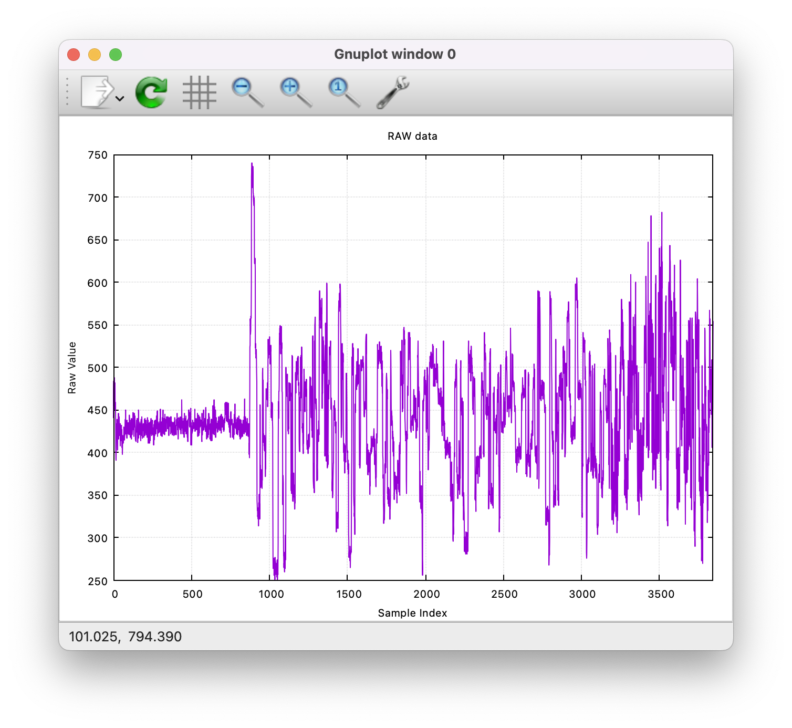

# Examples

## Consider making a shortcut

See [Getting Started](../getting-started.md) to learn how to build Sequelizer.  First, the build instructions leave you with a `sequelizer` binary in your `build` directory.  You might want to alias it for easier use:
```bash
some_dir $ alias sequelizer='<whatever_your_path_is>/build/sequelizer'
```
Now you can run Sequelizer commands with `sequelizer`.  The examples below assume you have done this.

## Sequelizer Examines Fast5's
You can use Sequelizer to analyze Fast5 files.  A mature file format that holds nanopore information, both raw DNA measurements and lots of useful metadata.  We (and you?) want circuits, computers, programs, networks working on this data to extract relevant genomic inisights anytime, anywhere.

To play around you'll want some Fast5 files on your system.  Here's how to download a sample dataset 
```bash
# Get some Fast5 files (this is ~2.4GB, with a 15MB/s download, it should take ~2.5 min)
some_dir $ wget https://ont-exd-int-s3-euwst1-epi2me-labs.s3-eu-west-1.amazonaws.com/fast5_tutorial/sample_fast5.tar
# Uncompress
some_dir $ tar -xvf sample_fast5.tar
# See what you got
some_dir $ ls
... sample_fast5/ ...
```
Now that you have some data in the `sample_fast5` directory, you can use Sequelizer to analyze the Fast5 files.  You do this using the package's `fast5` subcommand. Just point it to the directory with the `--recursive` flag to find all Fast5 files within:
```bash
# sequelize it
some_dir $ sequelizer fast5 sample_fast5 --recursive
Discovering Fast5 files...
Found 5 files, analyzing...
[[████████████████████████████████████████] 100% (5/5)

Sequelizer Fast5 Dataset Analysis Summary
=========================================
Files processed: 5/5 successful
Total file size: 2440.0 MB
Total reads: 20000
Signal statistics:
  Total samples: 679508454
  Average length: 33975 samples
  Range: 1978 - 1199785 samples
  Average bits per sample: 28.73
  Total duration: 2831.3 minutes
  Avg duration: 8.5 seconds
Processing time: 43.02 seconds
```
What happened?  Sequelizer scanned the Fast5 files, extracted some basic statistics about the raw signal data, and printed a summary report.  You can see how many reads were processed in the directory you scanned, their lengths, and other useful information.  Almost 30 bits per sample were used to store the raw signal data?  Awful if true.

If you want to know a little more about each read that was processed you could ask for a summary report to be made.
```bash
some_dir $ sequelizer fast5 sample_fast5 --recursive --summary
```
This will create a `sequelizer_summary.txt` file in your current directory with a line for each read processed, and some basic statistics about it.  For example:
```text
#sequelizer_summary_v1.0
filename	read_id	run_id	channel	start_time	translocation_time	num_samples	median_before
FAK42335_2bf4f211a2e2d04662e50f27448cfd99dafbd7ee_0.fast5	00058fe1-e555-4a64-a41b-7f58fb7d6d6b	2bf4f211a2e2d04662e50f27448cfd99dafbd7ee	 381	   52.1	   6.2	 24688	 204.58
FAK42335_2bf4f211a2e2d04662e50f27448cfd99dafbd7ee_0.fast5	000dd482-c0d5-4520-aa86-8ee8bb61fd58	2bf4f211a2e2d04662e50f27448cfd99dafbd7ee	 323	   12.3	   6.6	 26454	 219.28
FAK42335_2bf4f211a2e2d04662e50f27448cfd99dafbd7ee_0.fast5	00158d74-4b7f-445a-b0ac-e1606f6c09b7	2bf4f211a2e2d04662e50f27448cfd99dafbd7ee	 412	  111.4	   5.5	 21941	 162.95
FAK42335_2bf4f211a2e2d04662e50f27448cfd99dafbd7ee_0.fast5	004a0bd2-edcf-4c2c-89bc-009a232cdb6a	2bf4f211a2e2d04662e50f27448cfd99dafbd7ee	 477	  127.8	   6.6	 26345	 202.09
...
```

## Sequelizer Converts Fast5's
Sequelizer can also convert Fast5 files to other formats (well one format, for now).  For example, you can convert Fast5 files to txt using the `convert` subcommand:
```bash
some_dir  $ sequelizer convert sample_fast5 --to raw -r  
[████████████████████████████████████████] 100% (5/5)
```
In this case, the `--to raw` flag tells Sequelizer to convert the Fast5 files to raw text files.  The `-r` flag tells it to search recursively through the `sample_fast5` directory for Fast5 files.  After running this command, you will find `.txt` files in `some_dir`.  If you want them to go in a different directory, say `some_dir/signals/` then also include the command-line argument `-o signals`.

For single-read Fast5 files the default file name takes the form `read_ch<channel num>_rd<read num>.txt`.  For multi-read Fast5 files the default file name takes the form `<original fast5 files name>_read_ch<channe _num>_rd<read num>.txt`.  In this example, the Fast5 files in `sample_fast5` are multi-read files, so you should see files like:
```bash
some_dir $ ls
FAK42335_2bf4f211a2e2d04662e50f27448cfd99dafbd7ee_0_read_ch323_rd17.txt
FAK42335_2bf4f211a2e2d04662e50f27448cfd99dafbd7ee_0_read_ch381_rd59.txt
FAK42335_2bf4f211a2e2d04662e50f27448cfd99dafbd7ee_0_read_ch412_rd172.txt
FAK42335_2bf4f211a2e2d04662e50f27448cfd99dafbd7ee_100_read_ch108_rd3140.txt
...
```
By default, `convert` only extracts the first three reads from each Fast5 file that it finds.  You can change this with the `--all` flag which tells Sequelizer to extract all reads from each Fast5 file.

What's inside each `.txt` file?  Behold:
```text
# Channel: 198
# Offset: 6.000000
# Range: 1440.801147
# Digitisation: 8192.000000
# Conversion: signal_pA = (raw_signal + offset) * range / digitisation
# Sample Rate: 4000.0
# Duration: 3846
# Read ID: 00213bd6-0b7d-4e96-862f-160852db369a
#
sample_index	raw_sample
0	441
1	465
2	484
3	455
...
```
The header contains metadata about the read, including channel number, offset, range, digitization, conversion formula, sample rate, and read ID.  Below the header is a two-column table with the sample index and the corresponding raw signal value.

## Sequelizer Plots Signals
Sequelizer can also plot the raw signal data.  Once you have a set of `.txt` files (see above) you can use the `plot` subcommand to create plots of the signals.  For example:
```bash
some_dir $ sequelizer plot ./signals/FAK42335_2bf4f211a2e2d04662e50f27448cfd99dafbd7ee_100_read_ch198_rd2884.txt --title "RAW data"
```
Should produce a plot like this:



## Sequelizer Makes Fake Raw


## Before You Go
Please help Sequelizer development.  Tell us what else you'd like to see here!